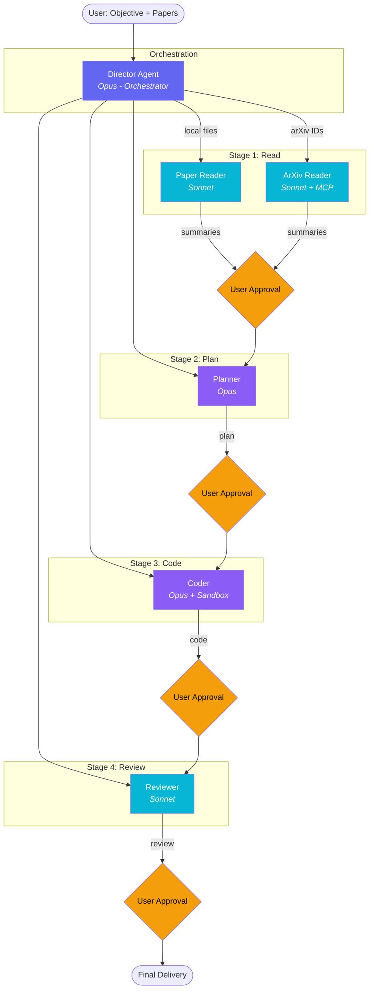
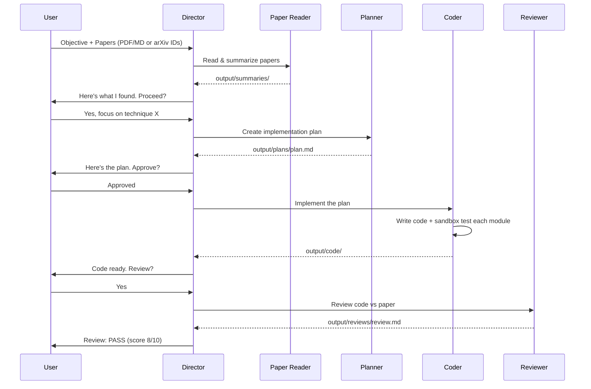
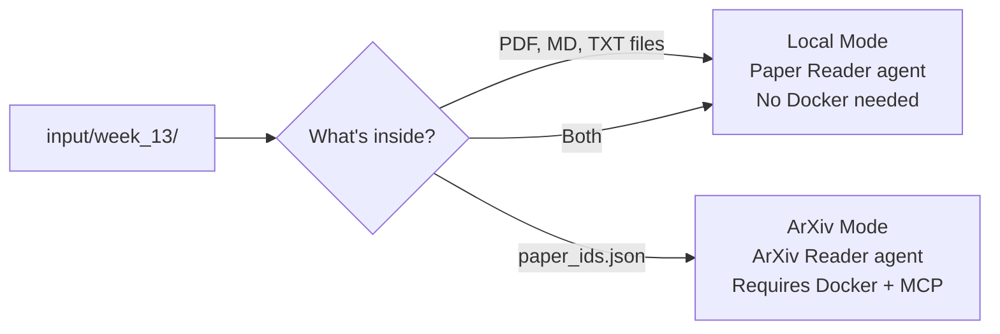
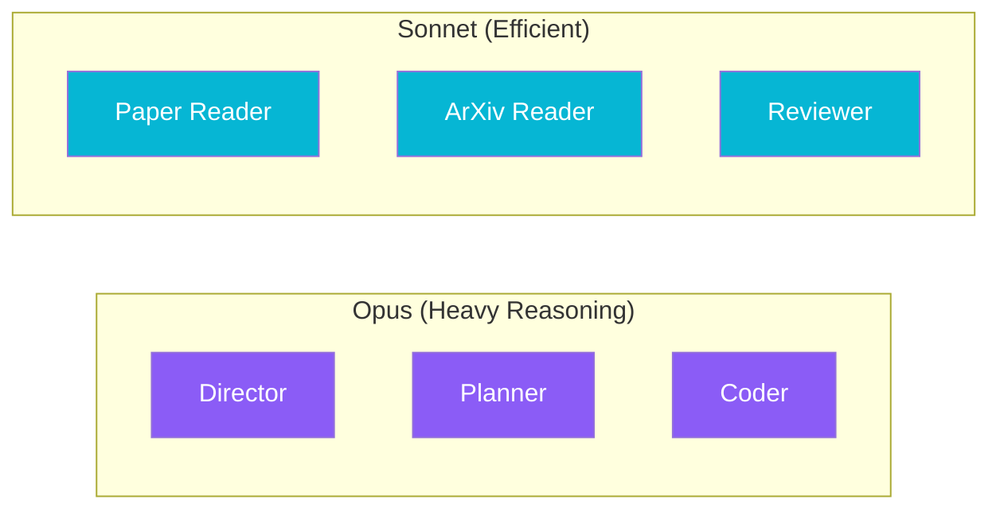

# Research Swarm - Paper-to-Production AI Pipeline

An agentic system that reads research papers (local PDFs or arXiv), generates implementation plans, writes code, and reviews it — all orchestrated by a central Director agent built on the **Claude Agent SDK**.

## Architecture



## Pipeline



## How It Works

You give the system an **objective** (e.g., "Build a transformer text classifier") and **research papers**. The Director runs a 5-stage pipeline:

| Stage | Agent | What it does | Output |
|-------|-------|-------------|--------|
| 1. Read | **Paper Reader** or **ArXiv Reader** | Reads and summarizes papers | `output/summaries/` |
| 2. Plan | **Planner** | Creates step-by-step implementation plan | `output/plans/plan.md` |
| 3. Code | **Coder** | Writes and sandbox-tests the code | `output/code/` |
| 4. Review | **Reviewer** | Reviews code for correctness & paper alignment | `output/reviews/review.md` |
| 5. Deliver | **Director** | Presents final summary | Terminal |

**User approval is required between every stage.**

### Two Input Modes



| What's in the folder | Mode | Reader agent | Docker needed? |
|---|---|---|---|
| PDF/MD/TXT files | `local` | **Paper Reader** — reads files directly | No |
| `paper_ids.json` | `arxiv` | **ArXiv Reader** — uses MCP server | Yes |
| Both | `local` | Local files take priority | No |

## Project Structure

```
agentsclaude/
├── main.py                        # CLI entry point
├── config.py                      # Paths, MCP config, model choices
├── requirements.txt
├── .env                           # API keys (not committed)
│
├── agents/
│   ├── director.py                # Orchestrator with colored terminal logging
│   ├── arxiv_reader.py            # Paper reading (local + arXiv sub-agents)
│   ├── planner.py                 # Implementation planning sub-agent (Opus)
│   ├── coder.py                   # Code writing + sandbox execution (Opus)
│   └── reviewer.py                # Code review sub-agent (Sonnet)
│
├── .claude/
│   ├── commands/                  # Slash commands for Claude Code
│   │   ├── research.md            # /research — full pipeline
│   │   ├── read-papers.md         # /read-papers — paper reading only
│   │   ├── plan.md                # /plan — planning only
│   │   ├── implement.md           # /implement — coding only
│   │   └── review.md              # /review — review only
│   │
│   └── skills/                    # Agent skills (auto-invoked behaviors)
│       ├── pipeline-status/       # Director: check pipeline state
│       ├── iterate-feedback/      # Director: rework loop with review feedback
│       ├── summarize-paper/       # Reader: structured paper summaries
│       ├── extract-equations/     # Reader: equation extraction & cataloging
│       ├── architecture-design/   # Planner: system architecture design
│       ├── dependency-analysis/   # Planner: library selection & analysis
│       ├── sandbox-execute/       # Coder: safe code execution & verification
│       ├── write-tests/           # Coder: pytest test generation
│       ├── paper-alignment-check/ # Reviewer: code vs paper fidelity check
│       └── security-audit/        # Reviewer: security vulnerability scan
│
├── input/                         # Papers organized by week
│   └── week_13/
│       ├── paper.pdf              # Drop PDFs directly here
│       ├── notes.md               # Or markdown files
│       └── paper_ids.json         # Or arXiv IDs (fallback)
│
├── output/                        # All generated artifacts
│   ├── summaries/                 # Paper summaries + _overview.md
│   ├── plans/                     # Implementation plans
│   ├── code/                      # Generated source code
│   └── reviews/                   # Code review reports
│
└── tests/
    ├── test_arxiv_mcp.py          # MCP server connectivity tests
    └── test_agent_skills.py       # Skill assignment & isolation tests
```

## Quick Start

### Prerequisites

- Python 3.11+
- [Claude Code CLI](https://docs.anthropic.com/en/docs/claude-code) installed (`claude --version`)
- An Anthropic API key
- Docker Desktop (only if using arXiv mode)

### Installation

```bash
git clone <repo-url>
cd agentsclaude

python -m venv venv
source venv/bin/activate
pip install -r requirements.txt
```

### Configuration

Create a `.env` file in the project root:

```env
ANTHROPIC_API_KEY=sk-ant-...your-key-here
ARXIV_STORAGE_PATH=/path/to/store/downloaded/papers
```

### Add Papers

**Option A: Drop files directly (recommended)**

```bash
mkdir -p input/week_14
cp ~/Downloads/attention_paper.pdf input/week_14/
cp ~/Downloads/another_paper.md input/week_14/
```

**Option B: Use arXiv IDs (requires Docker)**

```bash
mkdir -p input/week_14
echo '["2301.07041", "1706.03762"]' > input/week_14/paper_ids.json
docker pull mcp/arxiv-mcp-server
```

The system always picks the **latest week folder** automatically.

### Run

```bash
# Auto-detects papers from latest week folder
python main.py --objective "Build a transformer text classifier"

# With arXiv IDs (overrides folder detection)
python main.py --objective "Build a transformer text classifier" \
               --papers 2301.07041 1706.03762

# Interactive mode
python main.py
```

### Slash Commands (inside Claude Code)

```
/research Build a transformer text classifier    # Full pipeline
/read-papers                                      # Just read papers
/plan Build a text classifier                     # Just generate plan
/implement                                        # Just write code
/review                                           # Just review code
```

## Terminal Output

The Director provides colored, timestamped logs for every step:

```
============================================================
  Research Swarm — Director Starting
  Objective: Build a transformer text classifier
  Mode: LOCAL files
  Papers: 2 paper(s)
    - attention_paper.pdf
    - transformer_survey.md
  Week: week_13
============================================================

  [14:32:01] Session initialized

[14:32:03] Director:
  Starting Step 1 — reading papers...

[14:32:03] Spawning sub-agent: paper-reader
  Description: Read and summarize local paper files

[14:32:05] Task started: Read papers

[14:32:10] Task progress: Read papers (last tool: Read) [3,241 tokens]

[14:32:30] Task completed: Summarized 2 paper(s) to output/summaries/

[14:32:31] Director:
  Paper 1 proposes a novel attention mechanism...
  Which techniques should we proceed with?

============================================================
  Pipeline complete
  Duration: 142.3s | Turns: 24 | Cost: $0.1247
============================================================
```

Color coding:
- **Cyan** — Director messages
- **Magenta** — Sub-agent spawns
- **Yellow** — Tool calls
- **Green** — Tool results / successful completions
- **Blue** — Task progress
- **Red** — Errors

## Architecture Details

### Agent Models



| Agent | Model | Rationale |
|-------|-------|-----------|
| Director | Opus | Complex orchestration, multi-step reasoning |
| Paper Reader | Sonnet | Summarization is well-suited for Sonnet |
| ArXiv Reader | Sonnet | Summarization + MCP tool use |
| Planner | Opus | Architecture decisions need strong reasoning |
| Coder | Opus | Code generation benefits from Opus quality |
| Reviewer | Sonnet | Pattern-matching review is efficient on Sonnet |

### Human-in-the-Loop

The `can_use_tool` callback in `director.py` controls what's auto-approved:

| Action | Behavior |
|--------|----------|
| Read/Glob/Grep | Auto-approved |
| Write to `output/` | Auto-approved |
| ArXiv MCP tools | Auto-approved |
| Sub-agent spawns | Auto-approved |
| Bash commands | **Prompts user** with the command |
| Everything else | Auto-approved (configurable) |

### Skills System

Skills are reusable behaviors that agents invoke autonomously based on task context. Each agent has a restricted set of skills — enforced by the `skills` field on `AgentDefinition`.

```mermaid
graph TB
    subgraph "Director Skills"
        S1[pipeline-status<br/><i>Check pipeline state</i>]
        S2[iterate-feedback<br/><i>Rework loop orchestration</i>]
    end

    subgraph "Reader Skills"
        S3[summarize-paper<br/><i>Structured summaries</i>]
        S4[extract-equations<br/><i>Math extraction</i>]
    end

    subgraph "Planner Skills"
        S5[architecture-design<br/><i>System design</i>]
        S6[dependency-analysis<br/><i>Library selection</i>]
    end

    subgraph "Coder Skills"
        S7[sandbox-execute<br/><i>Safe code execution</i>]
        S8[write-tests<br/><i>Test generation</i>]
    end

    subgraph "Reviewer Skills"
        S9[paper-alignment-check<br/><i>Paper fidelity</i>]
        S10[security-audit<br/><i>Vulnerability scan</i>]
    end

    Director --> S1 & S2
    PaperReader --> S3 & S4
    ArxivReader --> S3 & S4
    Planner --> S5 & S6
    Coder --> S7 & S8
    Reviewer --> S9 & S10

    style S1 fill:#6366f1,color:#fff
    style S2 fill:#6366f1,color:#fff
    style S3 fill:#06b6d4,color:#fff
    style S4 fill:#06b6d4,color:#fff
    style S5 fill:#8b5cf6,color:#fff
    style S6 fill:#8b5cf6,color:#fff
    style S7 fill:#8b5cf6,color:#fff
    style S8 fill:#8b5cf6,color:#fff
    style S9 fill:#06b6d4,color:#fff
    style S10 fill:#06b6d4,color:#fff
```



| Agent | Skills | What They Do |
|-------|--------|-------------|
| **Director** | `pipeline-status`, `iterate-feedback` | Check which stages are done; orchestrate rework loops |
| **Paper Reader** | `summarize-paper`, `extract-equations` | Structured summaries; equation cataloging with LaTeX |
| **ArXiv Reader** | `summarize-paper`, `extract-equations` | Same as Paper Reader (shared skills) |
| **Planner** | `architecture-design`, `dependency-analysis` | Component diagrams; library selection with versions |
| **Coder** | `sandbox-execute`, `write-tests` | Run & verify each module; generate pytest suites |
| **Reviewer** | `paper-alignment-check`, `security-audit` | Code-vs-paper fidelity scoring; OWASP-style audit |

**How skills work:**
- Skills are defined as `SKILL.md` files in `.claude/skills/<name>/`
- Each `SKILL.md` has a `description` in YAML frontmatter — Claude uses this to decide when to invoke the skill
- Agents can only use skills listed in their `AgentDefinition.skills` field
- The `Skill` tool must be in the agent's `tools` list to enable skill invocation
- Skills are loaded via `setting_sources=["project"]` in the SDK options

**Skill isolation is enforced and tested** — the coder cannot use reviewer skills, the reviewer cannot execute code, and the planner cannot run sandboxes. See `tests/test_agent_skills.py`.

### MCP Integration (ArXiv Mode)

The ArXiv reader agent connects to `mcp/arxiv-mcp-server` via Docker, which provides:

- `search_papers` — Search arXiv by query
- `download_paper` — Download a paper by ID
- `read_paper` — Read the full text of a downloaded paper

The server communicates over stdin/stdout using the JSON-RPC-based MCP protocol.

## Testing

```bash
# Run all tests
python -m pytest tests/ -v

# Skill assignment & isolation tests only
python tests/test_agent_skills.py

# MCP connectivity tests only (requires Docker)
python tests/test_arxiv_mcp.py
```

### Skill tests verify (10 checks):
1. Each agent has exactly its assigned skills
2. No skill leaks across agent boundaries
3. All skilled agents have the `Skill` tool
4. Every skill has a `SKILL.md` file on disk
5. No orphan skill files without an agent
6. All skills have `description` in frontmatter
7. Both readers share identical skills
8. Coder has no reviewer skills
9. Reviewer has no execution skills
10. Planner has no execution skills

### MCP tests verify:
1. Docker is running
2. `mcp/arxiv-mcp-server` image exists
3. Storage path is writable
4. MCP server starts and lists tools
5. `search_papers` returns results

## Customization

### Adding or Modifying Skills

Skills are the primary way to steer agent behavior. Each skill is a markdown file that tells the agent **how** to do a specific task.

**To modify an existing skill:**

Edit the `SKILL.md` file directly. For example, to change how paper summaries are structured:

```bash
# Edit the summarization template
vim .claude/skills/summarize-paper/SKILL.md
```

Change the output format, add new sections, remove sections you don't need. The agent will follow the updated instructions on the next run.

**To add a new skill:**

1. Create the skill directory and file:
   ```bash
   mkdir .claude/skills/my-new-skill
   ```

2. Write the `SKILL.md` with YAML frontmatter:
   ```markdown
   ---
   description: One line explaining WHEN Claude should invoke this skill.
   Write specific keywords that match the task context.
   ---

   # My New Skill

   Instructions for the agent go here. Be specific about:
   - What inputs to expect
   - What steps to follow
   - What output format to produce
   - What rules to follow
   ```

3. Assign the skill to an agent in `agents/<agent>.py`:
   ```python
   # Add to the skills list
   MY_AGENT_SKILLS = ["existing-skill", "my-new-skill"]

   def make_my_agent():
       return (
           "my-agent",
           AgentDefinition(
               # ...
               tools=["Read", "Write", "Skill"],  # Skill tool required
               skills=MY_AGENT_SKILLS,
           ),
       )
   ```

4. Run the tests to verify assignment:
   ```bash
   python tests/test_agent_skills.py
   ```

**To remove a skill from an agent:**

Remove it from the agent's `skills` list in `agents/<agent>.py`. The `SKILL.md` file can stay on disk — it won't be invoked if no agent references it.

### Example: Customizing the Review Process

Say you want the reviewer to also check for performance issues:

1. Create the skill:
   ```bash
   mkdir .claude/skills/performance-review
   ```

2. Write `.claude/skills/performance-review/SKILL.md`:
   ```markdown
   ---
   description: Check generated code for performance bottlenecks,
   inefficient algorithms, and unnecessary memory allocations.
   ---

   # Performance Review

   ## Checklist
   - [ ] No O(n^2) algorithms where O(n log n) is possible
   - [ ] Tensors moved to correct device
   - [ ] No unnecessary .detach() or .clone() calls
   - [ ] Batch operations used instead of loops
   - [ ] Memory-efficient attention if sequence length > 512

   ## Output
   Write to output/reviews/performance.md
   ```

3. Add to reviewer in `agents/reviewer.py`:
   ```python
   REVIEWER_SKILLS = ["paper-alignment-check", "security-audit", "performance-review"]
   ```

4. Update the test expectations in `tests/test_agent_skills.py`:
   ```python
   EXPECTED_SKILLS = {
       # ...
       "reviewer": ["paper-alignment-check", "security-audit", "performance-review"],
   }
   ALL_SKILLS = { ..., "performance-review" }
   ```

5. Verify:
   ```bash
   python tests/test_agent_skills.py
   ```

### Skill Writing Tips

| Do | Don't |
|----|-------|
| Write a specific `description` with keywords | Use vague descriptions like "helps with stuff" |
| Include exact output file paths | Leave output location ambiguous |
| Define clear step-by-step instructions | Write abstract guidelines |
| Include output format templates | Let the agent decide the format |
| Set rules and constraints | Assume the agent will figure it out |

The `description` field is critical — it's what Claude reads to decide whether to invoke the skill. Include the exact words that would appear in a task that needs this skill.

### Adding a New Sub-Agent

1. Create `agents/my_agent.py` with a `make_my_agent()` function returning `(name, AgentDefinition)`
2. Create skills for the agent in `.claude/skills/`
3. Import and add it to `build_agent_definitions()` in `director.py`
4. Update the Director's system prompt to include the new agent in the workflow
5. Add skill expectations to `tests/test_agent_skills.py`
6. Optionally create a slash command in `.claude/commands/my-command.md`

### Changing Models

Edit `config.py`:

```python
DIRECTOR_MODEL = "claude-opus-4-6"
READER_MODEL = "sonnet"      # "opus", "sonnet", "haiku"
PLANNER_MODEL = "opus"
CODER_MODEL = "opus"
REVIEWER_MODEL = "sonnet"
```

## License

MIT
